# SceneModule - シーンモジュール

SceneModule は Unity の Scene と１対１になる形で画面を用意、運用する形態です

起動直後を除き、動作中は必ず単一の SceneModule が動作している必要があります

他の分類のモジュールは、このシーンモジュールに帰属する形で動作します

役割としては画面の開始時、あるいは別の画面へ遷移する際に用途ごとのメソッドを呼び出します

シーンモジュールには情報を司る SceneContext クラスと動作を司る SceneHandle クラスの２つが必要になります

SceneContext クラスではモジュールの状態取得、アセットの読み込み申請や、読み込んだアセットハンドルの管理、AmbentScene のリクエストを提供しています

SceneHandle クラスでは主に別のシーンモジュールへの遷移やモーダルモジュールの呼び出しを提供しています

## 構築

シーンモジュールとしての画面を構築するには以下の手順が必要となります

1. ModuleSetting の用意
1. [SceneContext を継承したクラスの作製](#scenecontext-を継承したクラスの作製)
1. [SceneModule を継承したクラスの作製](#scenemodule-を継承したクラスの作製)
1. [Scene の作成](#scene-の作成)

## SceneContext を継承したクラスの作製

画面の情報を保守するためのコンテキストクラスを作成します

パッケージで提供している SceneContext クラスを継承し、コンストラクタを実装してください。

継承元のコンストラクタ引数には Addressables でシーンを読み込むためのキーを記述してください

```SampleContext.cs
namespace Sample
{
	public sealed class Context : SceneContext
	{
		public Context() : base( "Sample")
		{
		}
	}
}
```

<details><summary>継承できるプロパティ、メソッド</summary>

## IsRestorableContext

RequestLoadScene() で別の SceneModule に進んだ後に、RequestBackScene() で元の SceneModule にコンテキストごと戻ってくることが出来ます

ただ、このプロパティで false が返される状態のコンテキストを使って RequestLoadScene() を呼び出した場合は RequestBackScene() で戻る対象と見做されなくなります

継承元では必ず true を返すので、戻る対象に含めたくない場合は override して false を返すようにしてください

## OnPreLoad

RequestLoadScene()、RequestReloadScene()、RequestBackScene() で別の SceneModuleへの遷移がリクエストされた際に、事前に必要となるアセットやAmbientModuleの読み込み申請ためのタイミングとして呼び出されます

アセットの読み込み申請には LoadAssetAsync() を、AmbientModule の読み込み申請には LoadAmbientSceneAsync() を使用してください。

## OnPrepare

SceneModule の読み込みが完了した状態で呼び出されます

ただし全てのアセットの読み込みが完了している保証はなく、直後にアセットの読み込み待ちが控えているため、最後のアセットの読み込みが行えるタイミングとなります

詳細な流れは [Flowchart](#flowchart) をご確認ください

</details>

## SceneModule を継承したクラスの作製

画面で起こる挙動を制御するためのコンポーネントクラスを作成します

パッケージで提供されている SceneModuleT を継承し、ジェネリックには[こちら](#scenecontext-を継承したクラスの作製)で作成したコンテキストクラスを明示してください

SceneModuleT には CreateDefaultContext() が abstract として定義されているため、override して、[こちら](#scenecontext-を継承したクラスの作製)で作成したコンテキストクラスを new して返すようにしてください

こちらは Editor で直接シーンを起動する場合や、最初に読み込まれるシーンの場合など、以前に SceneModule が稼働していなかった場合にのみ呼び出されるメソッドになります

```SampleModule.cs
namespace Sample
{
	sealed class SampleModule : SceneModuleT<Context>
	{
		protected override Context CreateDefaultContext()
		{
			return new Context();
		}
	}
}
```

## Scene の作成


## Flowchart

```mermaid
sequenceDiagram
participant PrevInheritanceModule
participant PrevSceneHandleT
participant NextSceneHandleT
participant NextInheritanceContext
participant NextInheritanceModule
	
	PrevInheritanceModule -)+ PrevSceneHandleT: request
	Note over PrevSceneHandleT: RequestLoadScene()
	
	opt Has focus
		PrevSceneHandleT ->> PrevInheritanceModule: callback
		Note over PrevInheritanceModule: OnFocusOut()
		PrevInheritanceModule -->> PrevSceneHandleT: yield break
	end
	
	PrevSceneHandleT -)+ PrevInheritanceModule: callback
	Note over PrevInheritanceModule: OnStop()
	PrevInheritanceModule --)- PrevSceneHandleT: yield break
	opt OnStop Invoke onFailure
		PrevSceneHandleT -)+ PrevInheritanceModule: callback
		Note over PrevInheritanceModule: OnResume()
		PrevInheritanceModule -->- PrevSceneHandleT: yield break
		
		opt Can focus
			PrevSceneHandleT ->>+ PrevInheritanceModule: callback
			Note over PrevInheritanceModule: OnFocusIn()
			PrevInheritanceModule -->- PrevSceneHandleT: yield break
		end
	end
	
	PrevSceneHandleT -)+ PrevInheritanceModule: callback
	Note over PrevInheritanceModule: OnClose()
	PrevInheritanceModule --)- PrevSceneHandleT: yield break
	
	PrevSceneHandleT -)+ NextInheritanceContext: callback
	Note over NextInheritanceContext: OnPreLoad()
	NextInheritanceContext --)- PrevSceneHandleT: yield break
	
	PrevSceneHandleT --)+ NextSceneHandleT: wait
	
	Note over PrevInheritanceModule,NextInheritanceModule: シーン読み込み
	Note over NextSceneHandleT: Awake()
	Note over NextSceneHandleT: Start()
	
	opt Not exists PrevInheritanceModule
		NextSceneHandleT -)+ NextInheritanceModule: callback
		Note over NextInheritanceModule: CreateDefaultContext()
		NextInheritanceModule --)- NextSceneHandleT: return context
		
		opt Error Context
			NextSceneHandleT -) PrevSceneHandleT: request
			Note over PrevSceneHandleT: Resume()
			
			PrevSceneHandleT -)+ PrevInheritanceModule: callback
			Note over PrevInheritanceModule: OnOpen()
			
			Note over NextSceneHandleT: Release()
			NextSceneHandleT -)+ NextInheritanceModule: callback
			Note over NextInheritanceModule: OnPreUnload()
			
			PrevInheritanceModule --)- PrevSceneHandleT: yield break
			NextInheritanceModule --)- NextSceneHandleT: yield break
			
			PrevSceneHandleT -)+ PrevInheritanceModule: callback
			Note over PrevInheritanceModule: OnResume()
			PrevInheritanceModule -->- PrevSceneHandleT: yield break
			
			opt Can focus
				PrevSceneHandleT ->>+ PrevInheritanceModule: callback
				Note over PrevInheritanceModule: OnFocusIn()
				PrevInheritanceModule -->- PrevSceneHandleT: yield break
			end
			
			Note over NextSceneHandleT, NextInheritanceModule: シーン破棄
		end
		
		NextSceneHandleT -)+ NextInheritanceContext: callback
		Note over NextInheritanceContext: OnPreLoad()
		NextInheritanceContext --)- NextSceneHandleT: yield break
	end
	
	NextSceneHandleT -)+ NextInheritanceContext: callback
	Note over NextInheritanceContext: OnPreper()
	NextInheritanceContext --)- NextSceneHandleT: yield break
	
	NextSceneHandleT -)+ NextInheritanceModule: callback
	Note over NextInheritanceModule: OnPreper()
	NextInheritanceModule --)- NextSceneHandleT: yield break
	
	Note over PrevInheritanceModule, NextInheritanceModule: アセット読み込み待ち
	
	NextSceneHandleT -)+ NextInheritanceModule: callback
	Note over NextInheritanceModule: OnSetup()
	NextInheritanceModule --)- NextSceneHandleT: yield break
	
	opt OnSetup Invoke onFailure
		NextSceneHandleT -) PrevSceneHandleT: request
		Note over PrevSceneHandleT: Resume()
		
		PrevSceneHandleT -)+ PrevInheritanceModule: callback
		Note over PrevInheritanceModule: OnOpen()
		
		Note over NextSceneHandleT: Release()
		NextSceneHandleT -)+ NextInheritanceModule: request
		Note over NextInheritanceModule: OnPreUnload()
		
		PrevInheritanceModule --)- PrevSceneHandleT: yield break
		NextInheritanceModule --)- NextSceneHandleT: yield break
		
		PrevSceneHandleT -)+ PrevInheritanceModule: callback
		Note over PrevInheritanceModule: OnResume()
		PrevInheritanceModule -->- PrevSceneHandleT: yield break
		
		opt Can focus
			PrevSceneHandleT ->>+ PrevInheritanceModule: callback
			Note over PrevInheritanceModule: OnFocusIn()
			PrevInheritanceModule -->- PrevSceneHandleT: yield break
		end
		
		Note over NextSceneHandleT, NextInheritanceModule: シーン破棄
	end
	
	NextSceneHandleT -)+ PrevSceneHandleT: callback
	Note over PrevSceneHandleT: Release()
	
	PrevSceneHandleT -)+ PrevInheritanceModule: request
	Note over PrevInheritanceModule: OnPreUnload()
	PrevInheritanceModule --)- PrevSceneHandleT: yield break
	
	Note over PrevInheritanceModule, PrevSceneHandleT: シーン破棄
	
	NextSceneHandleT -)+ NextInheritanceModule: callback
	Note over NextInheritanceModule: OnOpen()
	NextInheritanceModule --)- NextSceneHandleT: yield break
	
	NextSceneHandleT -)+ NextInheritanceModule: callback
	Note over NextInheritanceModule: OnStart()
	NextInheritanceModule --)- NextSceneHandleT: yield break
	
	opt Can focus
		NextSceneHandleT ->> NextInheritanceModule: callback
		Note over NextInheritanceModule: OnFocusIn()
		NextInheritanceModule -->> NextSceneHandleT: yield break
	end
	
```




